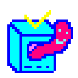

# DIRTY
a cross-platform toolkit for making games / interactive experiences

[website](http://tool.enemyspy.me/)

## example
here's a minimal window setup:

```rust
use dirty::*;
use gfx::shapes;
use input::Key;

struct Game;

impl State for Game {

	fn init(_: &mut Ctx) -> Result<Self> {
		return Ok(Self);
	}

	fn event(&mut self, d: &mut Ctx, e: &input::Event) -> Result<()> {

		use input::Event::*;

		match e {
			KeyPress(k) => {
				match *k {
					Key::Esc => d.window.quit(),
					_ => {},
				}
			},
			_ => {},
		}

		return Ok(());

	}

	fn draw(&mut self, d: &mut Ctx) -> Result<()> {

		d.gfx.draw(
			&shapes::text("hi")
				.size(16.0)
		)?;

		return Ok(());

	}

}

fn main() {
	if let Err(e) = run::<Game>() {
		elog!("{}", e);
	}
}
```

## platforms
- MacOS
- Windows
- Linux
- WASM
- iOS (WIP)
- Android (WIP)

for build instructions, check out `doc/dist.md`

## examples

the examples are under `examples/`, run them natively with

```sh
$ cargo run --example (example_name)
```

or go check out the built wasm examples [here](https://tool.enemyspy.xyz/examples.html)

## doc
docs are hosted [here](https://tool.enemyspy.xyz/doc/dirty/index.html), or you can `cargo doc` and generate yourself

there're some extra docs under `doc/`

## facts
- `DIRTY` is short for **Dangerous Ichthyopolist Reincarnates Tropical Yeti**

