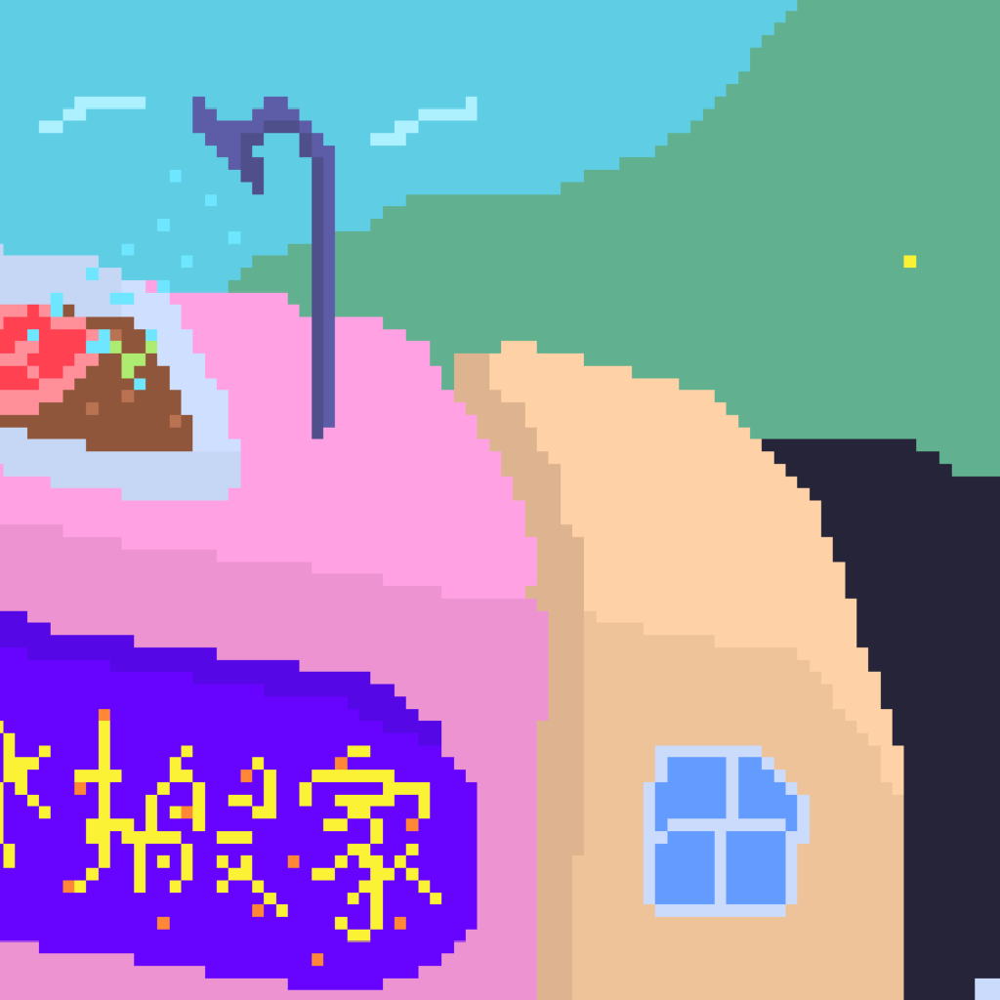

## DIRTY
personal toolkit for things

### modules
- **app** Windowing, Input, and Graphics
- **img** Image Loading & Writing
- **audio** Sound Loading & Playback
- **fs** Common File System Functions
- **geom** Common Collision Detections
- **physics** Simple Physics Simulation
- **http** Simple HTTP Client & Server
- **term** TUI Utilities

All the modules can be configured with cargo feature:

```toml
default = [ "fs", "app", "img", "audio", ]
```

### example
here's a minimal window setup:

```rust
use dirty::*;
use dirty::app::*;

struct Game;

impl app::State for Game {

	fn init(_: &mut app::Ctx) -> Result<Self> {
		return Ok(Self);
	}

	fn event(&mut self, ctx: &mut app::Ctx, e: input::Event) -> Result<()> {

		use input::Event::*;
		use input::Key;

		match e {
			KeyPress(k) => {
				if k == Key::Esc {
					ctx.quit();
				}
			},
			_ => {},
		}

		return Ok(());

	}

	fn draw(&mut self, ctx: &mut app::Ctx) -> Result<()> {

		ctx.draw_t(&gfx::t()
			.t3(vec3!(0, 0, -3))
			.ry(ctx.time())
			.rz(ctx.time())
		, &shapes::cube())?;

		ctx.draw(&shapes::text("yo"))?;

		return Ok(());

	}

}

fn main() -> Result<()> {
	return app::run::<Game>();
}

```

### examples

- **window** basic window and a cube
- **conf** window / graphics configs
- **sprite** a 2d animating sprite
- **3d** 3d obj viewer
- **mask** stencil mask
- **ttf** drawing text with truetype fonts
- **geom** basic geomatry / collision detections
- **dither** image processing
- **task** load resources on a different thread
- **request** making an http/https request
- **server** a simple http server

### facts
- `DIRTY` is short for **Dangerous Ichthyopolist Reincarnates Tropical Yeti**

